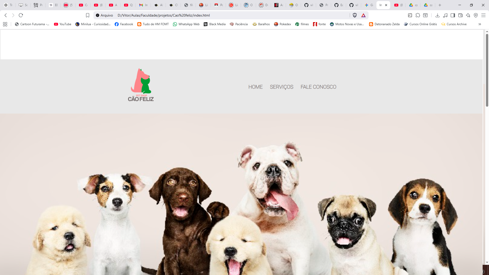
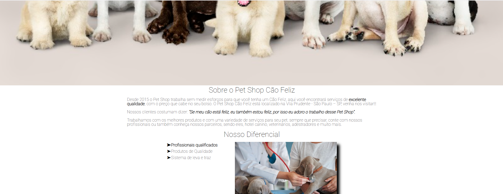
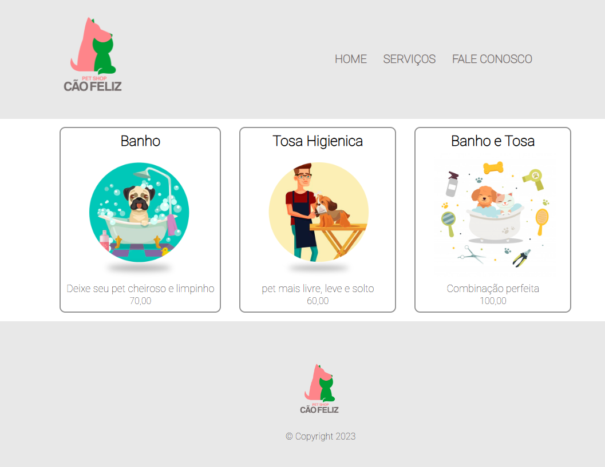

# Pet shop Cão feliz
Site de um pet shop feito na faculdade, para estudo de HTML, CSS
---

# Tecnologias 

--

# Funcionalidades
O projeto não possui muitas funcionaidades, foi criado com intuito de ser um estudo de organização de tags HTML, folha de estilo CSS, com estilização, reset, interação com site com pseudo seletor
--

# Preview

